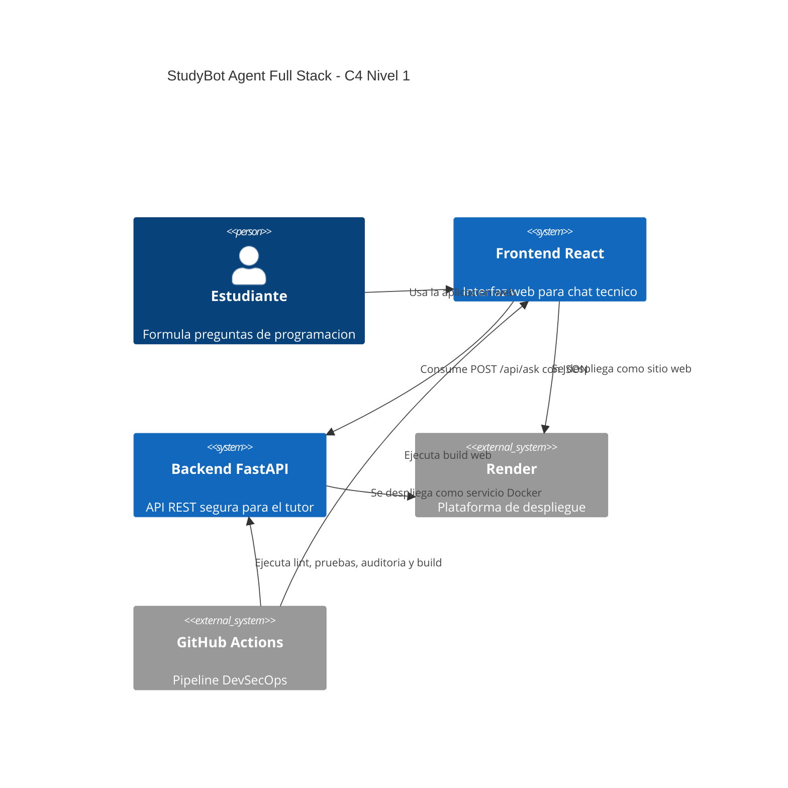

# Arquitectura

## C4 Nivel 1: Contexto del Sistema

## Componentes

### Frontend

- `frontend/src/pages/Home.jsx`: pagina principal de la experiencia web.
- `frontend/src/components/Navbar.jsx`: identidad visual y estado de la
  plataforma.
- `frontend/src/components/Hero.jsx`: presentacion de valor del producto.
- `frontend/src/components/ChatBox.jsx`: chat interactivo, historial, loader y
  errores.
- `frontend/src/components/MessageBubble.jsx`: mensajes con Markdown y codigo.
- `frontend/src/components/Loader.jsx`: animacion de escritura.
- `frontend/src/components/Footer.jsx`: cierre visual del producto.
- `frontend/src/services/api.js`: cliente Axios centralizado.
- `frontend/src/index.css`: TailwindCSS y estilos globales.

### Backend

- `src/main.py`: fabrica la app FastAPI, CORS e incluye routers.
- `src/api/routes.py`: endpoints `/health` y `/ask`.
- `src/api/schemas.py`: modelos Pydantic.
- `src/core/logging.py`: configuracion de logs.
- `src/config.py`: variables de entorno con `.env`.
- `src/validator.py`: validacion y sanitizacion.
- `src/agent.py`: orquestacion del agente de programacion.
- `src/programming/classifier.py`: clasificacion de categoria y estilo.
- `src/programming/knowledge.py`: recuperacion local de conocimiento tecnico.
- `src/programming/responses.py`: generacion de respuestas Markdown.
- `src/tools/notes.txt`: conocimiento controlado de programacion.

## Flujo de Datos

1. El estudiante escribe una pregunta en el chat web.
2. React guarda el mensaje en el historial local.
3. Axios envia `POST /api/ask` al backend FastAPI.
4. Pydantic valida el contrato JSON.
5. `validator.py` revisa longitud, XSS, SQL injection basica y sanitiza.
6. `StudyBotAgent` clasifica categoria y estilo de respuesta.
7. El agente busca conocimiento tecnico local.
8. El generador produce Markdown contextualizado.
9. FastAPI retorna JSON.
10. React muestra Markdown, tablas y codigo resaltado.

## Limites de Seguridad

- **Cliente web**: no se confia en la validacion del navegador como control
  unico; el backend valida nuevamente.
- **CORS**: origenes permitidos definidos por `CORS_ORIGINS`.
- **Entrada**: bloqueo de `<script>`, patrones SQL comunes e inputs mayores a
  500 caracteres.
- **Conocimiento**: el agente solo consulta `src/tools/notes.txt`.
- **Secretos**: `.env` no se versiona y las claves futuras deben ir en variables
  de entorno.
- **Contenedores**: backend ejecutado con usuario no root.
- **CI/CD**: fallos de lint, pruebas, cobertura o auditoria detienen el flujo.

## Decisiones de Arquitectura

- Se conserva el backend inicial y se expande con paquetes `api/` y `core/`.
- El frontend vive en `frontend/` para permitir despliegue independiente.
- La comunicacion entre capas es HTTP/JSON para mantener bajo acoplamiento.
- La logica del agente es deterministica y modular para facilitar pruebas.
- TailwindCSS y componentes React separan presentacion de comunicacion API.
